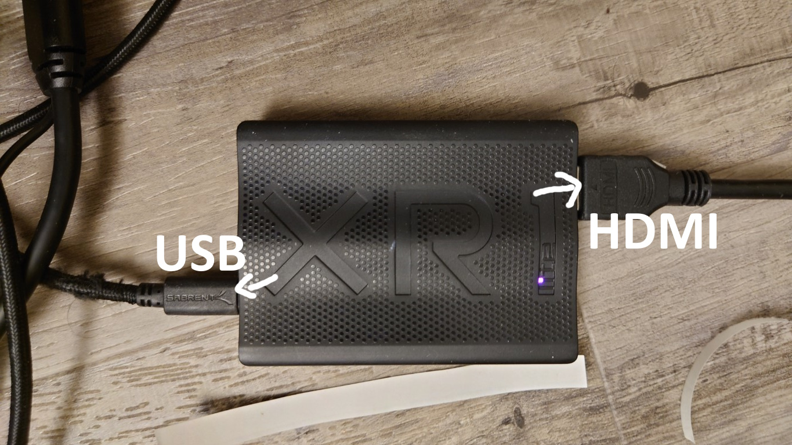
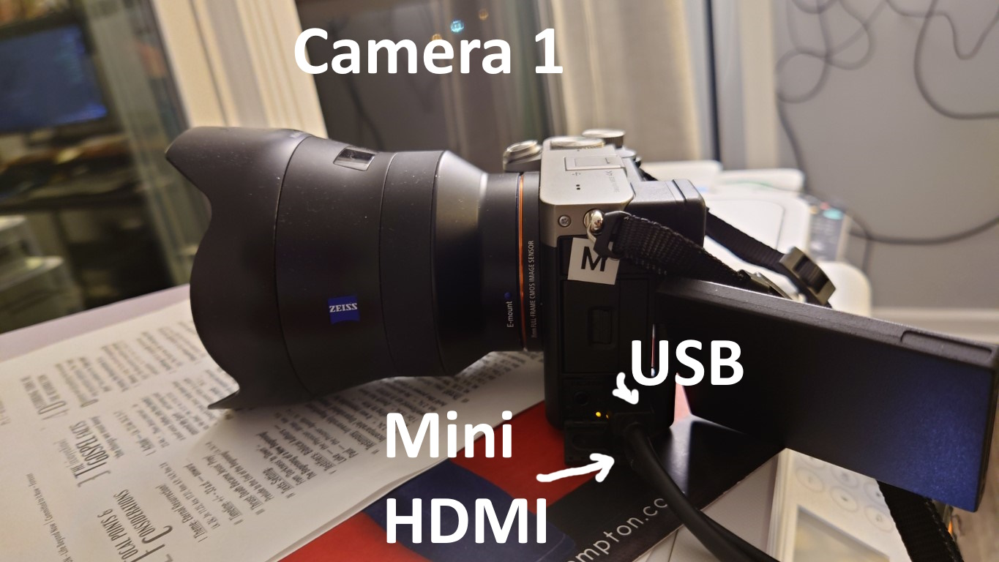
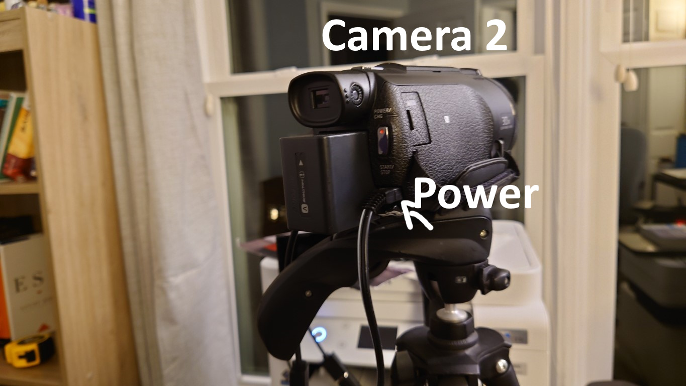
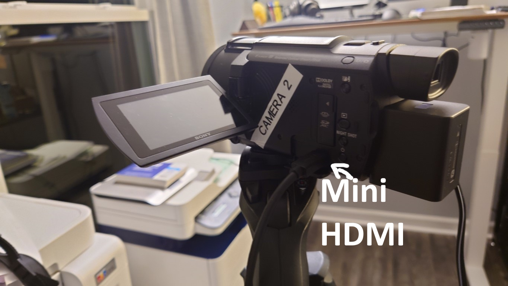
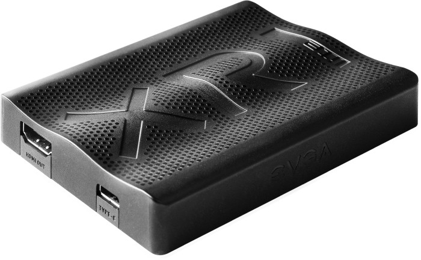
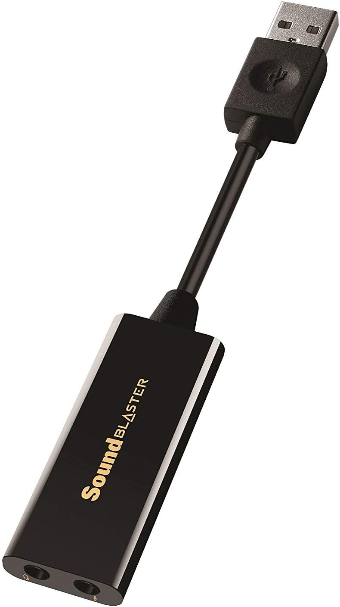
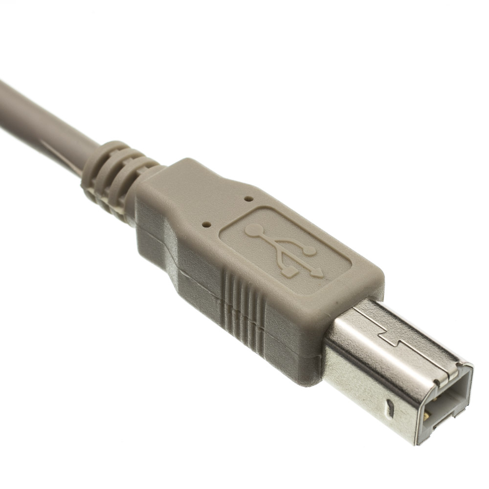

# Camera

There are 2 camera. They are named as Camera 1, Camera 2.

## Equipment

Setup the connections as provided below

### Capture Cards + Others

|                               |      |                                     |
| ----------------------------- | ---: | ----------------------------------- |
| USB of both capture card (U)  |  --> | Multi-USB hub - USB Port            |
| HDMI of both capture card (H) |  --> | HDMI cable each                     |
| Multi-USB hub                 |  --> | Power Supply                        |
| SoundBlaster                  |  --> | Multi-USB hub - USB Port            |
| 3.5mm (AUX cable)             |  --> | SoundBlaster - Mic jack             |
| Printer cable                 |  --> | Multi-USB port - next to power port |
| USB A side of printer cable   |  --> | The USB extender                    |
| USB extender                  |  --> | Power Supply                        |
| USB extender - Male USB A     |  --> | LiveStream laptop                   |

### Camera 1

|               |      |                            |                           |
| ------------- | ---: | -------------------------- | ------------------------- |
| Facing        |    - | Stage                      |                           |
| HDMI (H)      |    - | Capture Card -  Camera 1   |                           |
| Power (P)     |    - | USB C + Charger            |                           |
| 3.5mm mic (M) |    - | Other side of 3.5 mm cable | red color - left side top |

### Camera 2

|           |      |                          |
| --------- | ---: | ------------------------ |
| Facing    |    - | Guests/Entrance          |
| HDMI (H)  |    - | Capture Card -  Camera 1 |
| Power (P) |    - | Proprietary Pin          |

Once connections are done

1. Turn on the power of the cameras.

## Glossary

*Capture Card*

*Sound Blaster*

*Printer Cable*

